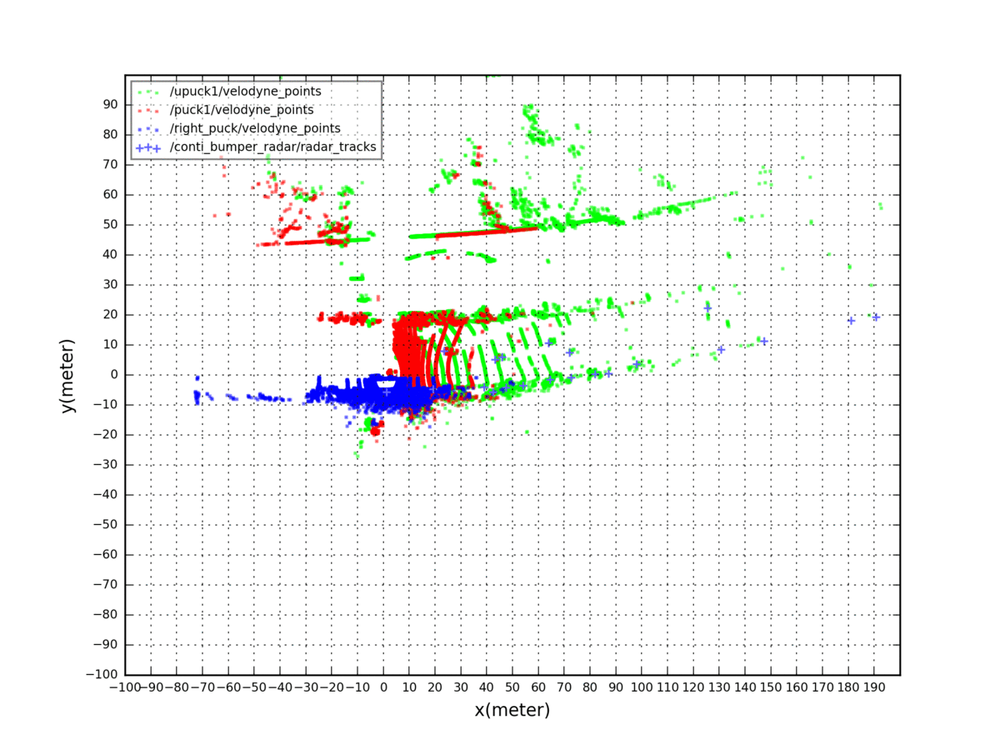
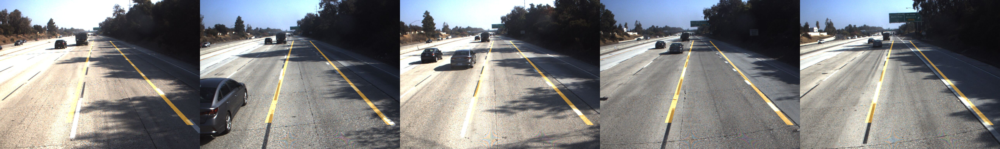

Calibration_viewer

```bash
$ cd scripts
$ python -m calibration_viewer/calibration_viewer --bag your.bag --cam_topic left_camera right_camera --cam_calibs front_left_camera.yml front_right_camera.yaml --output_dir ~/Work/test/calibration_viewer/ --show_golden_lane
```

top down view
------------------
top-down view view ( lidar and radar)


stitched_image
----------------
stitched image


stitched cylindrical image


Golden_lane
-----------
golden lane should match the ego lane boundary when we drove in the middle and along with lane direction



